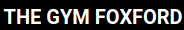
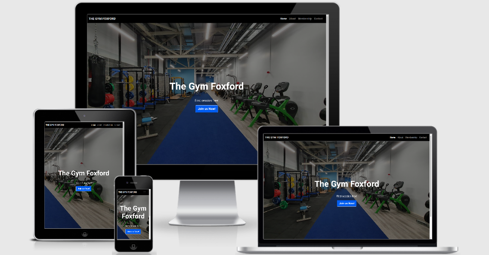
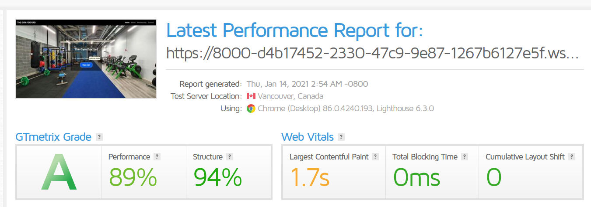
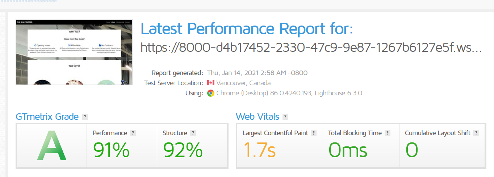
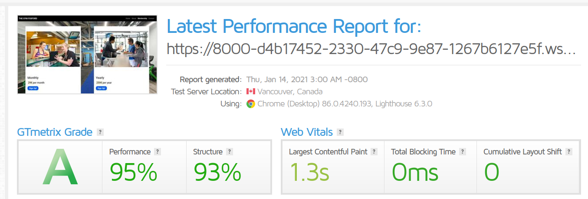
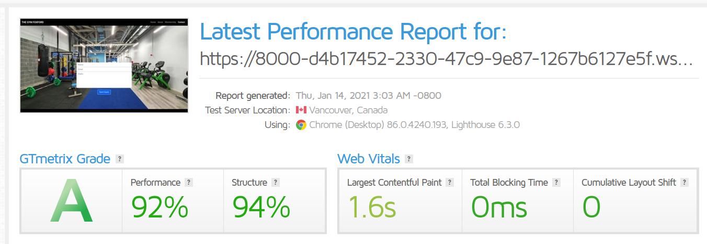
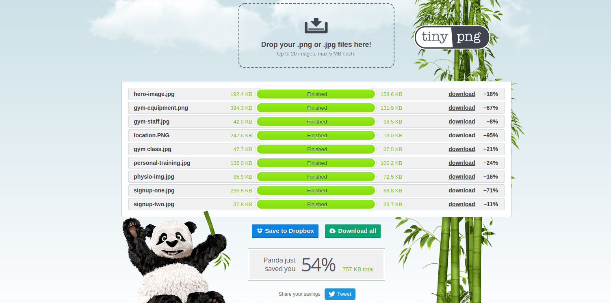

## Description

this is a fictional business website created for my milestone project 1

A modern styled website for a fictional gym that is fully equipped and standards with added classes and long opening hours. It's hope is to attract new members through an easy to use website.

[LIVE DEPLOYMENT](https://mchugh1894.github.io/thegymfoxford//) 

## Wireframes
The completed wireframes for this project can be accesed by clicking [Wireframes](https://github.com/McHugh1894/thegymfoxford/tree/master/assets/Wireframes)

## UX

### Speed Testing

After compressing all the website images i then chose to run all my pages through [GT Metrix - Speed test](https://gtmetrix.com//) to get a view of the page load speeds.

This website is for a gym. The images and colours have been selected as black & blue to capture attention while not overloading the user.

As the website is built to be responsive on smaller devices the navigation bar will shrink to a drop down menu with a hamburger icon.

Across all pages a footer with social links to allow the user to learn more about the gym itself and also contact details.

Overview - All pages built to be responsive on mobiles, tablets and desktops. All three uses of the website will be expected to be of use.

* Home - The home page is designed to provide a clear call to action to result in people wanting to sign up to the gym while also looking attractive to the user. - this has been accomplished by using bootstrap features. the main focus point of this page is a jumbotron in the center with a button to insight users to sign up. 

* About - The About page is used to provide information about the gym. Basic infomation is displayed such as our equipment, location and opening hours. This page is designed to be simple but effective in showing what we are about without overloading the user with information.

* Membership - The focus of the Membership page is showing our membership options. It shows the two of monthly and yearly while also having two images of people signing up for a gym. It has two simple sign up buttons under both membership options making it easy to sign up in one click.

* Contact - The Contact page has been designed to be simple and easy to use to help the user get in contact with the gym with ease to help create a positive view, the form requires basic user information and email data to be submitted so that the gym can respond the user directly and individually to create a better user experience.

## User Stories
User:

* The user would like to be able to sign up for the gym online.
* The user would like to be able to see the services and equipment available in the gym.
* The user would like to be able to have access to the gyms social media.
* The user would like to be able to see the membership prices and also its opening hours.
* The user would like to be able to contact the business.

Purpose:

* To provide an easy to use website showing the gym and what the gym offers.
* To provide a website that is simple and easy to navigate so the potential member isn't put off by an overload of information.
* To provide a simple to use service for potential members to join the gym.
* To provide information as to the location and contact details of the gym.

Designer:

* Simple - To prevent information overload
* Colours - black/blue similar to our building and equipment colors. Keeping the website with this theme.
* Call to action - Clear sign up button located on each page to allow ease of access when signing up
* Responsive - Must be responsive to all platforms to allow ease of use and to increase potential customers for the business

 Target Audiance:

* Fitness motivated people.
* Gym users of all ages.
* Local sports clubs.
* Located in Foxford.

 ## Technologies
The technologies i have used for this project are:

* HTML5
* CSS3
* Bootstrap 4

## External resources

* [Tinypng](http://https://tinypng.com/) - Website used to compress my images to allow for faster loading times. 
* [Stack Overflow](https://fonts.google.com/) - Resource which provided the fonts for the website
* [Font Awesome](https://fontawesome.com/) - Used to provide small icons for the website.
* [Favicon](https://favicon.io/) - Used to create favicon for the website
* [W3C HTML Validator](https://validator.w3.org/) - Used to test HTML code on the website.
* [W3C CSS Validator](https://jigsaw.w3.org/css-validator/) - Used to test the CSS code on the website.

## Testing

### Error Testing

* [W3C HTML Validator](https://validator.w3.org/) - ALL HTML pages passed with no errors after corrections made.
* [W3C CSS Validator](https://jigsaw.w3.org/css-validator/) - CSS style sheet passed with no errors.

### Image Testing

In order to help the website load faster all of the images were removed from the website and then uploaded to [Tinypng](http://https://tinypng.com/) in order to compress the images to more reasonable file sizes to increase loading speed.

### User Story Testing:

* The user would like to be able to sign up for the gym online.

The user can achieve this by clicking the "sign up!" button on the jumbotron of the homepage and also from the sign up buttons on the membership page. - when clicked a form launches for the user.

* The user would like to be able to see the equipment and location of the gym.

The user will see this by clicking on the "About" page which provides all of this information.

* The user would like to be able to have access to the gyms social media. 

The user will be able to do this by clicking on any of the social icons across the footer of all pages. - each link has been clicked and launches a new window tab with the correct social media site.

* The user would like to be able to see the membership options of the gym and also its opening hours.

The user can see this information on the "Membership" and "About" page.

* The user would like to be able to contact the gym if any issues arise.

The user can contact the gym by clicking the contact section of the navigation bar and filling out the contact form.

## Deployment

* [The Gym Foxford](https://mchugh1894.github.io/thegymfoxford/) site is hosted using GitHub pages.

* The deployed site is hosted directly through github so all commits are live.

* To deploy on github open: https://mchugh1894.github.io/thegymfoxford/ -> settings -> scroll to Guthub Pages -> Select Source -> Master Branch -> Save -> After page refresh scroll pack down to github pages section to see the deployed link.

* For local use please visit: https://mchugh1894.github.io/thegymfoxford/ and clone the relevant code from the master branch by selecting code -> Then copy the url -> Open Git Bash on your system -> Change the current directory to where you want the clone to be made -> type "git clone" and paste the URL eg "https://mchugh1894.github.io/thegymfoxford/" -> Press Enter to create your local clone

## Credits

* Credits go to my mentor Akshat Garg and the Codeinstitute/slack group for the help with this project.

### Inspiration
* I have a huge interest in sports, health and fitness which is why i made this website.

### Media 

* [Hero Image](https://www.sportirelandcampus.ie/facilities/national-indoor-arena-private-gym) - Hero Image resource.
* [Equipment Image](https://www.sportsjoe.ie/world-of-sport/6-best-pieces-gym-equipment-according-fitness-pros-203880) - Equipment Image resource. 
* [Staff Image](https://media.istockphoto.com/photos/gym-registration-picture-id1014073852?k=6&m=1014073852&s=612x612&w=0&h=1mqOjmqCGXB-tazZCI5U5H7kBVJ9nP--caKW2JLhCHI=) - Staff Image resource
* [Location Image](https://www.google.com/maps/@53.9958889,-9.0691308,14.75z) Location Image Resource - Screenshot Taken.
* [Group Class Image](https://www.pinterest.ie/pin/779333910505040746/) - Group Class Image Resource.
* [Personal Training Image](https://1-life.ca/personal-training-nutrition/) - Personal Training Image Resource.
* [Physio Image](https://nextlevelphysiotherapy.com/) - Physio Image Resource.
* [Sign Up Image One](https://blogs.canterbury.ac.nz/insiders/2020/02/11/reccentre-membership-renewals-for-2020/) - Sign Up Image One Resource.
* [Sign Up Image Two](https://media.istockphoto.com/photos/gym-registration-picture-id1014073852?k=6&m=1014073852&s=612x612&w=0&h=1mqOjmqCGXB-tazZCI5U5H7kBVJ9nP--caKW2JLhCHI=) - Sign Up Image Two Resource.

### Credited Code  
* [Bootstrap](https://getbootstrap.com/) - Documents used for support with bootstrap classes.
* [Code Institute](https://courses.codeinstitute.net/courses/course-v1:codeinstitute+FE+2017_T3/courseware/616289d66b5641a3808cc43e53842695/b51f7b8b815c4bcd9979d2281b6d97a9/?activate_block_id=block-v1%3Acodeinstitute%2BFE%2B2017_T3%2Btype%40sequential%2Bblock%40b51f7b8b815c4bcd9979d2281b6d97a9) This link is where i got the code for the footer. I modified it to suit the needs of my website.
